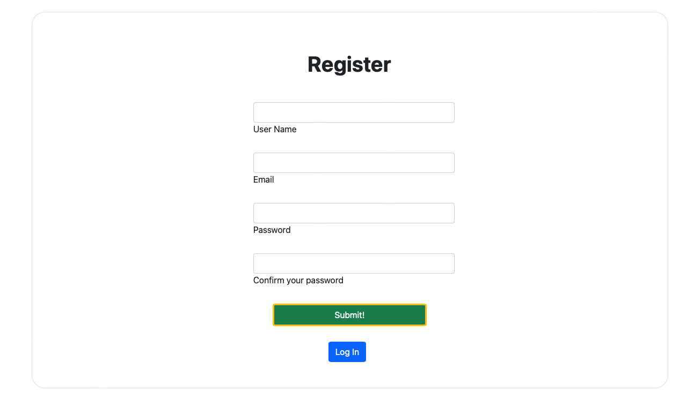
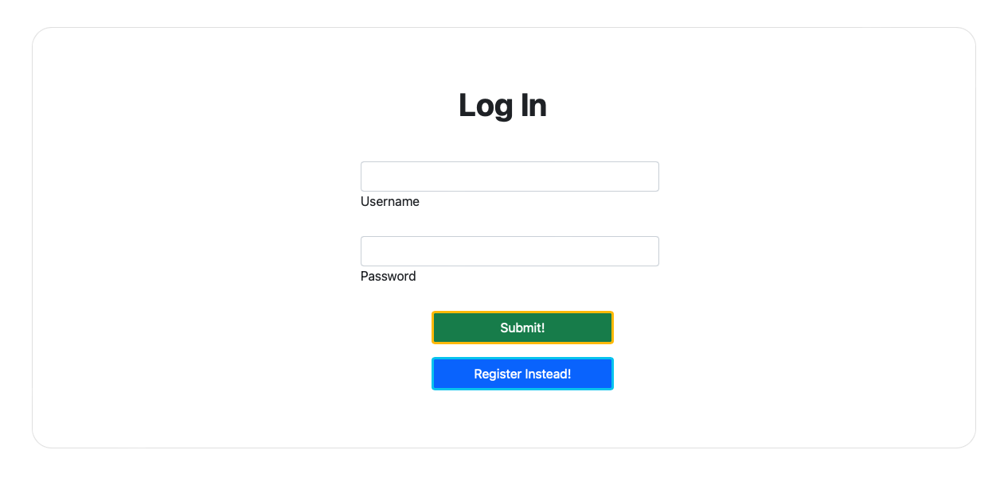
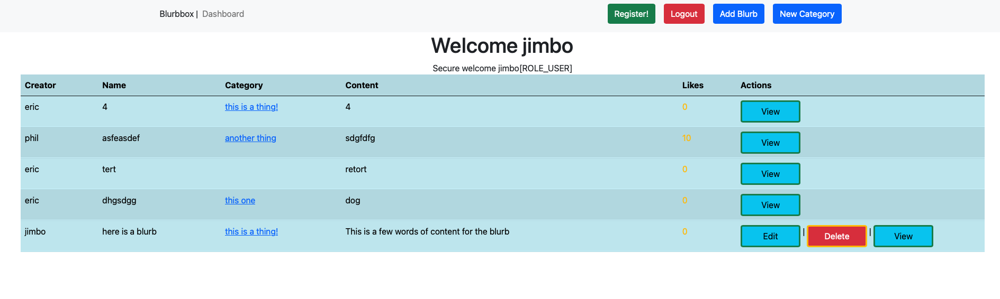
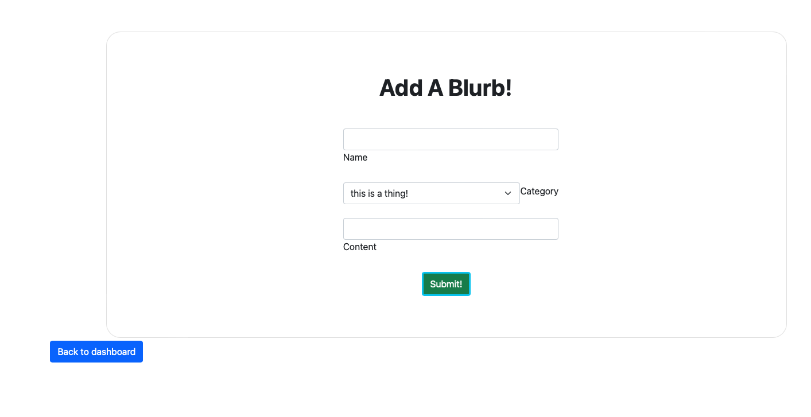
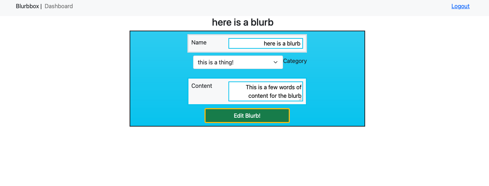
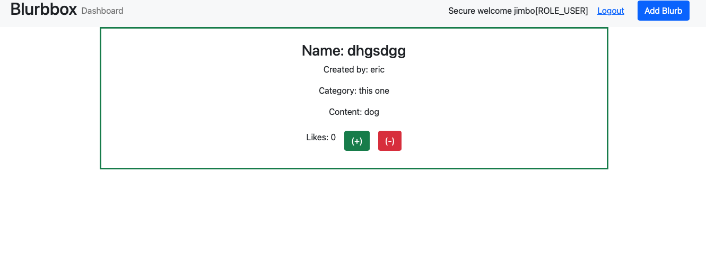
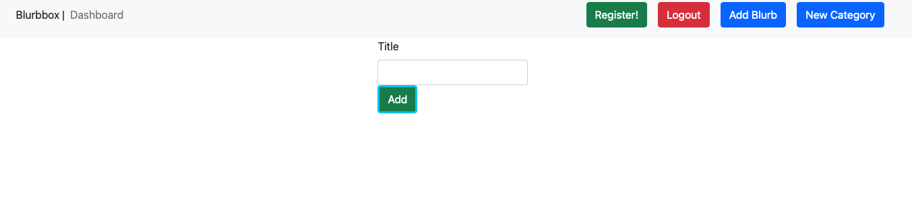
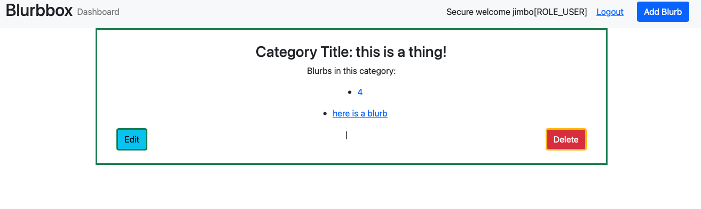

# blurbbox
Full stack web application written in Java and SpringBoot. 
Tech used in this application includes; JPA, JSP rendering, Hibernate Persistence, MySQL database, Bootstrap 5, jQuery, Figma (wireframe), Maven, 
Spring MVC, full CRUD functionality, conditional rendering, Spring Security.  

Included below are snapshots of each page of the application

Registration:

Login:

Home:

Create Blurb:

Edit Blurb:

View Blurb:

Create Category:

View Category:

